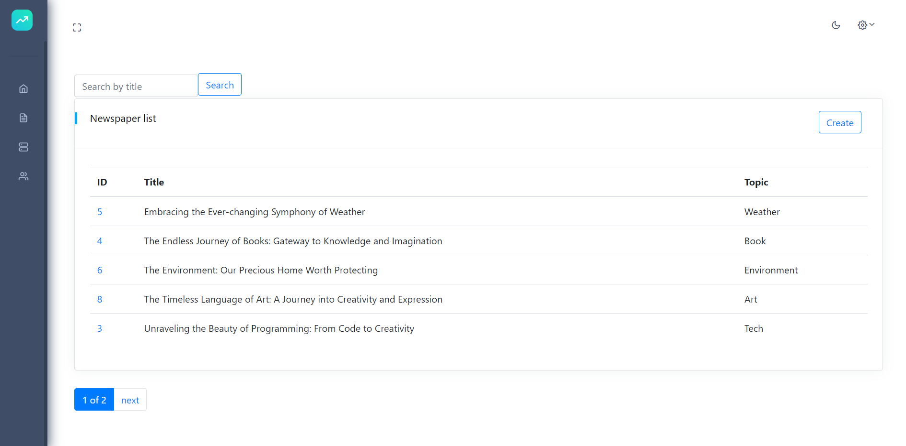
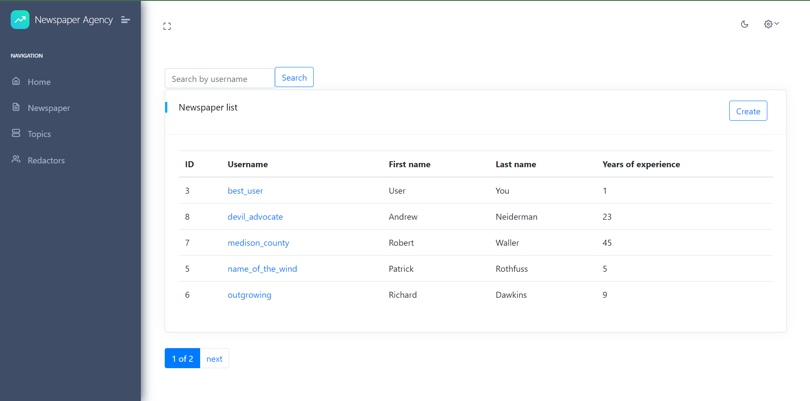
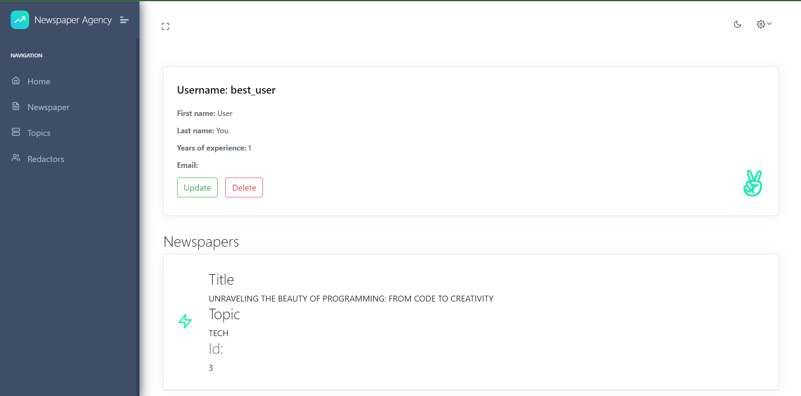

# Newspaper Agency

System for tracking Redactors, assigned to Newspapers.

## Check it out!
[Newspaper Agency project deployed to Render](https://newspaper-agency-6lg8.onrender.com)

## Table of Contents
1. [ Introduction. ](#introduction)
2. [ Features. ](#features)
3. [ Technologies Used. ](#technologies-used)
4. [ Getting Started. ](#getting-started)
5. [ Shutdown ](#shutdown)
6. [ Usage. ](#usage)
7. [ Accessing the Application. ](#accessing-the-application)
8. [ Demo. ](#demo)
8. [ Contributing. ](#contributing)

## Introduction

The Newspaper Redactor Tracking System is a web application designed to help the Newspaper Agency track and manage the assignment of redactors to newspapers. This system allows the chief and administrators to have clear visibility on which redactors were assigned to each newspaper, ensuring proper attribution and record-keeping.

As the chief of the Newspaper Agency, you can now easily monitor and manage the publishers of each newspaper with the help of this system. By keeping track of the redactors assigned to newspapers, you can ensure proper credit is given and maintain a record of the publishing history of your agency.

## Features
* Redactor Assignment: Administrators can assign specific redactors to individual newspapers during the publishing process.
* Redactor Profile: The system maintains a profile for each redactor, containing details such as their years of experience and published newspapers.
* Newspaper History: The system records the publishing history of each newspaper, along with the names of the redactors who were assigned to it.
* Search Functionality: The system allows you to search for newspapers and redactors based on various criteria.

## Technologies Used

* Python and Django Framework for the backend
* HTML, CSS, and JavaScript for the frontend
* SQLite database for data storage

## Getting Started

### Prerequisites
* Python (version 3.6 or higher) and pip installed on your system
* Git (optional, for cloning the repository)

### Installation
1. Clone the repository:
```
git clone https://github.com/your-username/newspaper-redactor-tracking.git
cd newspaper-redactor-tracking
```

2. Create a virtual environment (optional but recommended):
```
python -m venv env
source env/bin/activate      
# For Windows: env\Scripts\activate
```
3.  Edit the `.env` using the template `.env.sample`.

```
# True for development, False for production
DJANDO_DEBUG=True
```

4. Install dependencies:
```
pip install -r requirements.txt
```

5. Run database migrations:
```
python manage.py migrate
```

6. Create a superuser to access the admin panel:
```
python manage.py createsuperuser
```

7. Start the development server:
```
python manage.py runserver
```

8. Open your web browser and navigate to http://localhost:8000/.

## Shutdown
To stop running app in your terminal press:
```
ctrl + C
```

## Usage
* Administrators can log in to their accounts and manage redactor assignments for each newspaper.
* The system will maintain records of redactors and their published newspapers, providing easy access to their profiles and history.

## DB Structure


## Accessing the Application
* The Django application is accessible at http://localhost:8000/
* The Admin page can be accessed at http://localhost:8000/admin

* If you wish to explore the application on a deployed server, access it at: https://newspaper-agency-6lg8.onrender.com and use following credentials:
```
login: best_user
password: !userchik1
```

Remember to replace `localhost` with the relevant IP address if you're not accessing these from the same machine where the services are running.

## Demo








## Contributing
I welcome contributions to improve the Newspaper Redactor Tracking System. Feel free to submit bug reports, feature requests, or pull requests to `yanaakhlamova@gmail.com`
